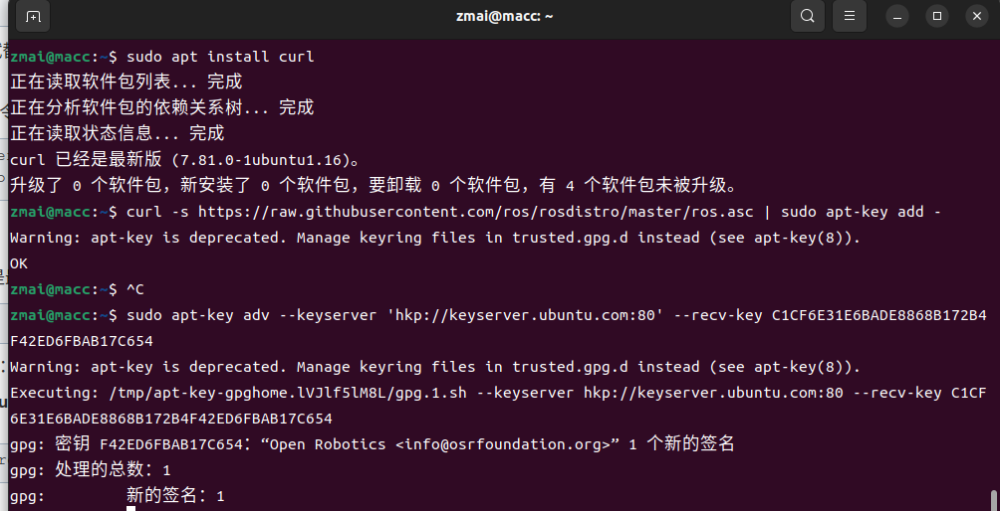
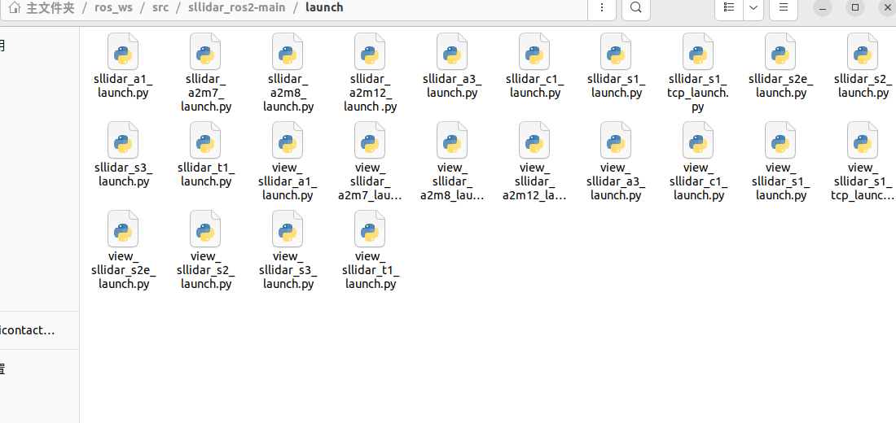
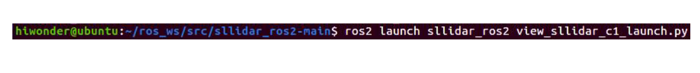
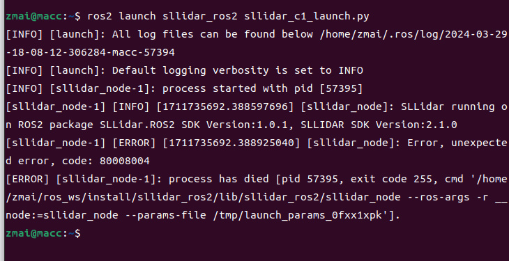

## Lidar learning

### **1. Configure environment**

most popular env:
ubuntu 22.04 + ros2 humble
ubuntu 20.04 + ros1 noetic

```
#查看robot的配置环境
gedit .bashrc
# 查看主机当前版本
lsb_release -a
# 查找ros版本与位置
apt list --installed | grep ros-

# test ros e.g.
ros2 run demo_nodes_cpp talker
# opent another terminal 
ros2 run demo_nodes_py listener

# stop
 ctrl + c

```



### **2. test lidar**

* oepn source file download
ensure the situation is true


```
# 查看 usb接口设备名称
ls/dev/ttyUSB*
# 一般是ttyUSB0

```
* 编译环境设置


* run rviz
  oepn a new terminal
```
ros2 launch sllidar_ros2 view_sllidar_c1_launch.py
```

(terminal 的位置，好像不一定需要跟图片一样的，此处斟酌一下，更新文档)

* run lidar test
新建一个Terminal，确保Terminal是在home下!很重要



    如果连接不成功，如上图展示：
    1. 连接有问题，电源不足5v
    2. usb接口权限不够
    sudo chmod 777 /dev/ttyUSB0
    3. 反复重启运行
    ros2 launch sllidar_ros2 sllidar_c1_launch.py

### transfer path
20240403： 
In order to better record the development code and notes of the laser SLAM part, this part is transferred to a new branch.