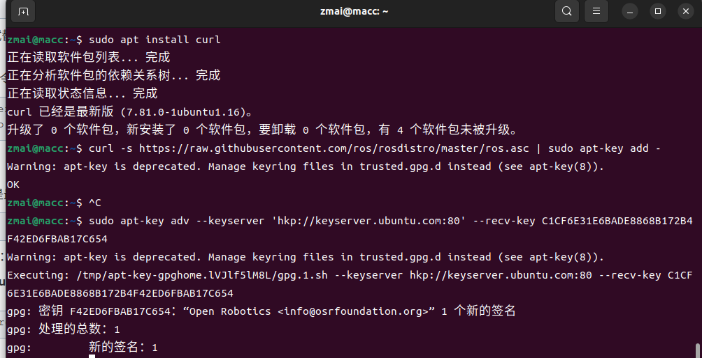
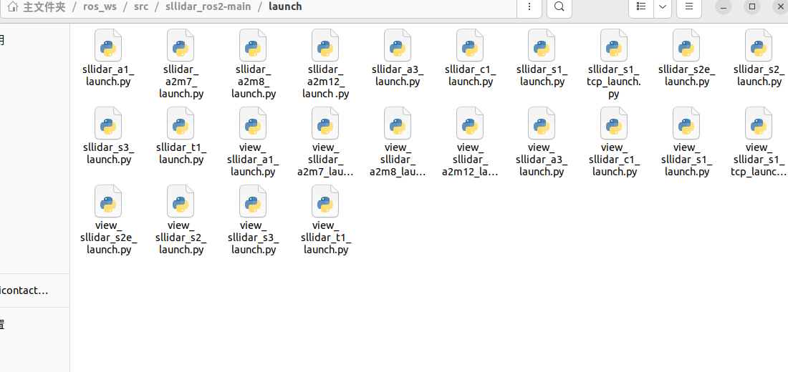
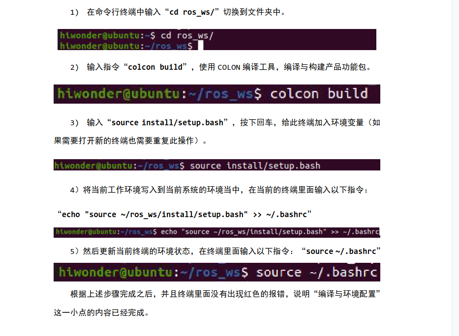
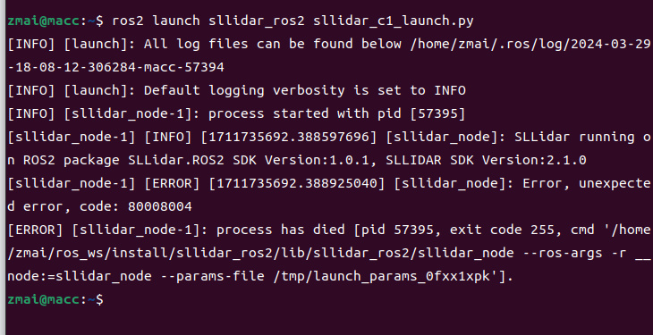
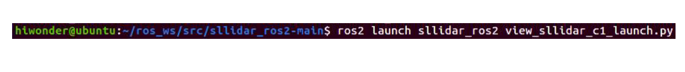
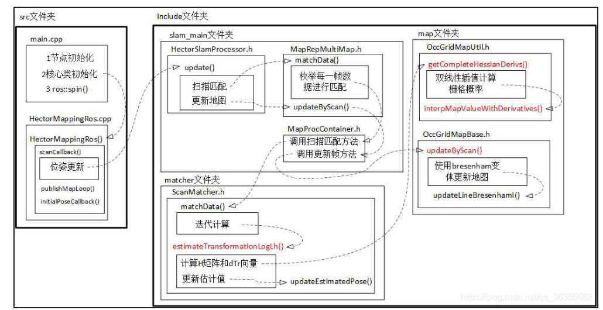
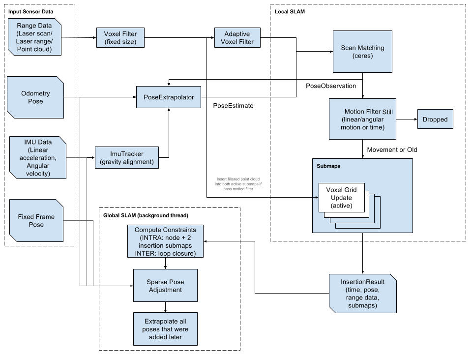
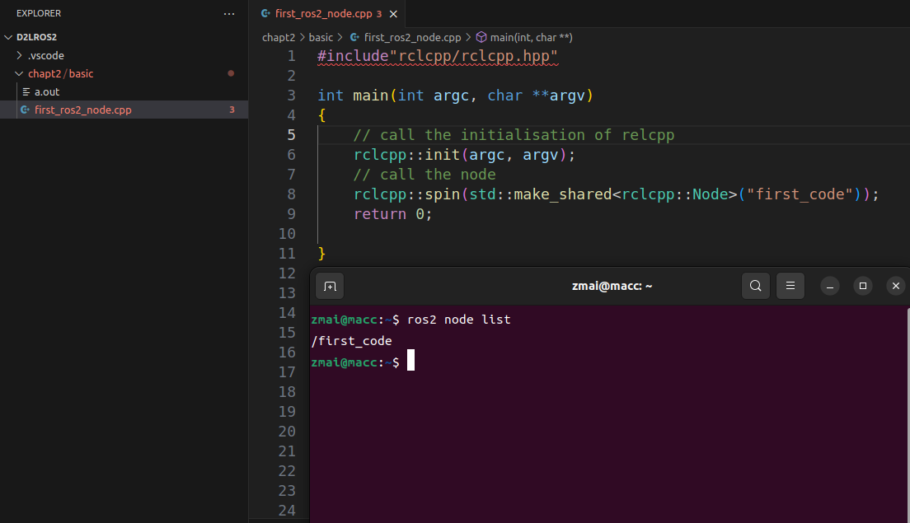
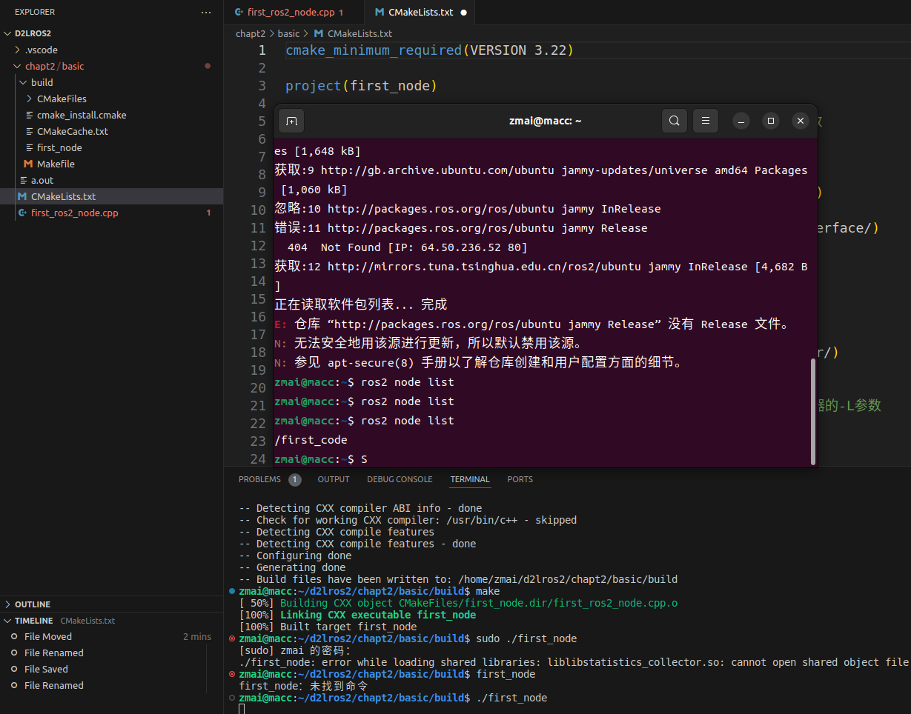

## Lidar learning (In Ros)

### **1. Configure environment**

most popular env:
ubuntu 22.04 + ros2 humble
ubuntu 20.04 + ros1 noetic

```
#查看robot的配置环境
gedit .bashrc
# 查看主机当前版本
lsb_release -a
# 查找ros版本与位置
apt list --installed | grep ros-

# test ros e.g.
ros2 run demo_nodes_cpp talker
# opent another terminal 
ros2 run demo_nodes_py listener

# stop
 ctrl + c

```



### **2. test lidar**

* oepn source file download
ensure the situation is true


```
# 查看 usb接口设备名称
ls /dev/ttyUSB*
# 一般是ttyUSB0

```
* 编译环境设置(初次，后续不需要)

---
- test terminal:
新建一个Terminal，确保Terminal是在home下!很重要



test 1 : run lidar
test 2: run lidar + rviz

* run lidar
>ros2 launch sllidar_ros2 sllidar_c1_launch.py

close: 
>ctrl + c

* run rviz
  (oepn a new terminal)
```
ros2 launch sllidar_ros2 view_sllidar_c1_launch.py
```
close: 
>ctrl + c



* run lidar test error:
    如果连接不成功，如上图展示：
    1. 连接有问题，电源不足5v
    2. usb接口权限不够
    sudo chmod 777 /dev/ttyUSB0
    3. 反复重启运行
    ros2 launch sllidar_ros2 sllidar_c1_launch.py

### transfer path
20240403： 
In order to better record the development code and notes of the laser SLAM part, this part is transferred to a new branch.

### **3. mapping**
- metric map
- topologic map
- semantic map


#### Hector slam
can't use in ros2
http://wiki.ros.org/hector_mapping


> unfortunally, Hector slam is not useful in ros2

- rplidar_sdk is cpp???
how to use it?

直接看lidar的sdk代码（cpp），很难！

bilibili:
迈达令

#### cartographer
https://google-cartographer.readthedocs.io/en/latest/evaluation.html




### **4. ROS2**


1. g++ build node (c++)


2. cmakelist build node


make processing method:
> mkdir build
> cd build
> cmake ..   # because the CMakeLists.txt is one level above the **build** file
> ./first node
> ros2 node list   # check node

#### node
四种通信方式:

    话题-topics
    服务-services
    动作-Action
    参数-parameters
##### start the node
>ros2 run <package_name> <executable_name>
e.g.
>ros2 run turtlesim turtlesim_node

##### CLI（Command-Line Interface）& GUI（Graphical User Interface）
运行节点(常用)

>ros2 run <package_name> <executable_name>

查看节点列表(常用)：

>ros2 node list

查看节点信息(常用)：

>ros2 node info <node_name>

重映射节点名称

>ros2 run turtlesim turtlesim_node --ros-args --remap __node:=my_turtle

运行节点时设置参数

>ros2 run example_parameters_rclcpp parameters_basic --ros-args -p rcl_log_level:=10

---
working space ---> packages ---> nodes

install package for function what you want
>sudo apt install ros-<version>-package_name

#### colcon
    --packages-select ，仅生成单个包（或选定的包）。
    --packages-up-to，构建选定的包，包括其依赖项。
    --packages-above，整个工作区，然后对其中一个包进行了更改。此指令将重构此包以及（递归地）依赖于此包的所有包。

```
# build package (for example_pp)
colcon build --package-select example_cpp

# after that, I can active/build the node
# install source
source install/setup.bash

# node_03 active
ros2 run example_cpp node_03

# see it 
ros2 node list

```

#### Communication principles
1.TCP/UDP
e.g. UDP
> ping 192.168.0.1
e.g. TCP
> nc -l 1234
> ssh team@192.168.1.xx

2.zeroMQ


### 5.practice
https://zhuanlan.zhihu.com/p/583952047
