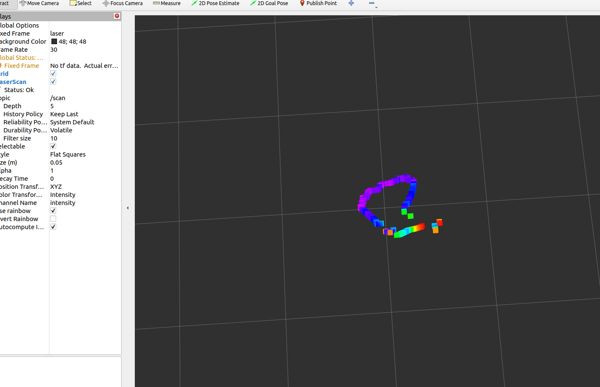

# Lidar drive study

## 




## mapping filter
filter condition:
1. 0<distance<1 (meter)
2. quality >0
3. limit angle:
0-90度 对应于 0 - π/2 弧度
270-360度 对应于 3π/2 - 2π 弧度

LidarCenteredPoints
 
mapping

3. limit angle test


4. PCL package
>sudo apt update
sudo apt install libpcl-dev

## basic drive (CMakeLists.txt)
use build.sh
advantage: tidy file
```
# via usb, terminal

# step0
ls /dev/ttyUSB*

# step1 kv
chmod +x build.sh

# step2
./build.sh

```

## basic drive (makefile)
```
# via usb, terminal
# step0
ls /dev/ttyUSB*
# step1 
sudo chmod 777 /dev/ttyUSB0
# step2
cd ~/文档/code_program/git_ku/rplidar_sdk/output/Linux/Release
# step3
./ultra_simple --channel --serial /dev/ttyUSB0 460800
```
> teminal describe:
    argc (argument count)
        argc 的值将是 6
        因为这个命令总共有 6 个参数,包括程序名本身
    argv (argument vector)
        argv 是一个字符串数组,每个元素对应一个命令行参数
        argv 的内容如下:
            argv[0] = "./ultra_simple" (程序名)
            argv[1] = "--channel" (第一个参数)
            argv[2] = "--serial" (第二个参数)
            argv[3] = "/dev/ttyUSB0" (第三个参数)
            argv[4] = "460800" (第四个参数)
            argv[5] = NULL (作为参数列表的结尾,指向NULL指针)

```
Ultra simple 运行成功，一开始的打印：

Ultra simple LIDAR data grabber for SLAMTEC LIDAR.
Version: 2.1.0
SLAMTEC LIDAR S/N: 897DE1F4C2E398C4BCEA9AF307A64802
Firmware Ver: 1.01
Hardware Rev: 18
SLAMTEC Lidar health status : 0

```

goal: 
1. change the makefile to makelist.txt
path:

### sdk

>include
│   ├── rplidar_cmd.h
│   ├── rplidar_driver.h
│   ├── rplidar.h
│   ├── rplidar_protocol.h
│   ├── rptypes.h
│   ├── sl_crc.h
│   ├── sl_lidar_cmd.h
│   ├── sl_lidar_driver.h 
│   ├── sl_lidar_driver_impl.h
│   ├── sl_lidar.h
│   ├── sl_lidar_protocol.h
│   └── sl_types.h
├── Makefile
└── src
    ├── arch
    │   ├── linux
    │   │   ├── arch_linux.h
    │   │   ├── net_serial.cpp
    │   │   ├── net_serial.h
    │   │   ├── net_socket.cpp
    │   │   ├── thread.hpp
    │   │   ├── timer.cpp
    │   │   └── timer.h
    │   ├── macOS
    │   │   ├── arch_macOS.h
    │   │   ├── net_serial.cpp
    │   │   ├── net_serial.h
    │   │   ├── net_socket.cpp
    │   │   ├── thread.hpp
    │   │   ├── timer.cpp
    │   │   └── timer.h
    │   └── win32
    │       ├── arch_win32.h
    │       ├── net_serial.cpp
    │       ├── net_serial.h
    │       ├── net_socket.cpp
    │       ├── timer.cpp
    │       ├── timer.h
    │       └── winthread.hpp
    ├── dataunpacker
    │   ├── dataunnpacker_commondef.h
    │   ├── dataunnpacker_internal.h
    │   ├── dataunpacker.cpp
    │   ├── dataunpacker.h
    │   ├── dataupacker_namespace.h
    │   └── unpacker
    │       ├── handler_capsules.cpp
    │       ├── handler_capsules.h
    │       ├── handler_hqnode.cpp
    │       ├── handler_hqnode.h
    │       ├── handler_normalnode.cpp
    │       └── handler_normalnode.h
    ├── hal
    │   ├── abs_rxtx.h
    │   ├── assert.h
    │   ├── byteops.h
    │   ├── byteorder.h
    │   ├── event.h
    │   ├── locker.h
    │   ├── socket.h
    │   ├── thread.cpp
    │   ├── thread.h
    │   ├── types.h
    │   ├── util.h
    │   └── waiter.h
    ├── rplidar_driver.cpp
    ├── sdkcommon.h
    ├── sl_async_transceiver.cpp
    ├── sl_async_transceiver.h
    ├── sl_crc.cpp
    ├── sl_lidar_driver.cpp
    ├── sl_lidarprotocol_codec.cpp
    ├── sl_lidarprotocol_codec.h
    ├── sl_serial_channel.cpp
    ├── sl_tcp_channel.cpp
    └── sl_udp_channel.cpp
2 resource:

 https://github.com/trigger1996/Rplidar_Raspberry/tree/master

### structure 

#### drive.cpp

```c++
// 重要类和函数
// argc -- 命令行传入总的参数数量， argv -- 命令行参数内容
// 参数之间，命令行一般是空格隔开？
// argv[0] -- 执行程序运行的完整地址，e.g.-- ./ultra_simple
// argv[1] -- 命令行第一个参数内容，...
int main(int argc, const char * argv[]) 

// 类，定义给后面的指针用，意思是通信的通道：USB，UDP等
IChannel* _channel; 

// 前面有一个创建检测lidar健康的
 

// 调用createLidarDriver()函数,创建一个ILidarDriver类型的对象实例。
// 将创建的对象实例赋值给名为_drv的变量。
ILidarDriver * drv = *createLidarDriver(); 
// drv调用connect连接通道，查看是否成功
SL_IS_OK((drv)->connect(_channel)


``` 


```c++
// 一些结构体
    /**
    * Lidar scan mode
    */
    struct LidarScanMode
    {
        // Mode id
        sl_u16  id;

        // Time cost for one measurement (in microseconds)
        float   us_per_sample;

        // Max distance in this scan mode (in meters)
        float   max_distance;

        // The answer command code for this scan mode
        sl_u8   ans_type;

        // The name of scan mode (padding with 0 if less than 64 characters)
        char    scan_mode[64];
    };


typedef struct sl_lidar_response_measurement_node_hq_t
{
    sl_u16   angle_z_q14; // 角度
    sl_u32   dist_mm_q2; // 距离
    sl_u8    quality; // 质量
    sl_u8    flag; // 标志位？？？
} __attribute__((packed)) sl_lidar_response_measurement_node_hq_t;
```