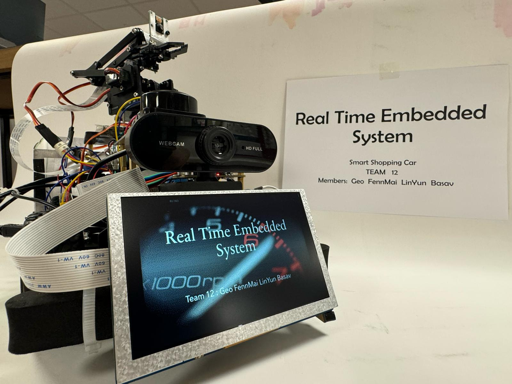
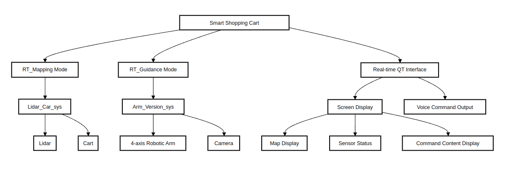

# Real Time Embedded System Project
- **Project name: Smart Shopping Cart**  
- **Group 12**




## Project Introduction

Smart shopping cart is a device designed for locating goods within a supermarket. This device is dedicated to assisting customers and staff in swiftly and accurkvately locating desired products or executing logical planning within the supermarket. Throughout its operation, it also aims to avoid foot traffic and attempts to re-plan routes accordingly.


## Build it
```
method 
# Grant execute permissions to the build script
chmod +x build.sh

# Run the build script to configure, build, and run the project
./build.sh

# Run the SSC
./data/bin/SSC

# method 2
cd data/build
cmake ../..
make
```
## The latest status

>202400420：
update the qt + lidar + car + voice system
now status: voice receive the command, then control the system in real time
bug: timer and thread
how to fix the bug: test and rebuild the lidar timer and ...
fix time : 20240501


## Project Members

| Name      | Email                                   | Contribution                                       | GitHub                              |
| --------- | --------------------------------------- | -------------------------------------------------- | ----------------------------------- |
| Zhixin Mai | [2937965M@student.gla.ac.uk](mailto:2937965M@student.gla.ac.uk)        | ... | [FennMai](https://github.com/FennMai)    |
| Chaoxu Ji | [2940201J@student.gla.ac.uk](mailto:2940201J@student.gla.ac.uk) | ... | [Linyunn](https://github.com/Linyunn)    |
| Basav Prasad | [2961731P@student.gla.ac.uk](mailto:2961731P@student.gla.ac.uk) | ... | [basav-sketch](https://github.com/basav-sketch)    |
| Jiahao Yang | [2841007Y@student.gla.ac.uk](mailto:2841007Y@student.gla.ac.uk) | ... | [RedAmancy918](https://github.com/RedAmancy918)    |


## Web link: 
https://fennmai.github.io/Real_Time_Embedded_Team_Project/

## Key Features
1. **Real-time Response:** Our product immediately stops to maintain a distance when encountering pedestrians blocking the way. At the same time, it replans a new route with less crowd density.
2. **Convenience:** When customers have many products to buy and find them hard to locate, our friend will help them quickly pinpoint the items, avoiding aimless wandering.
3. **Universality:**     Our product is suitable for most malls or supermarkets, as long as they can provide a layout map and the coordinates for each product.


## Technical Architecture
1. **Raspberry Pi**
   - **Sensor Interface:**  Interfaces with various sensors to gather data for object detection and collision avoidance.
   - **Data Processing:**  Processes user inputs, executes pathfinding algorithms, and controls motor movements using dedicated software algorithms like Dijkstra's or A* search algorithm.
   - **Motor Control Interface:** Connects to a motor driver board (e.g., L298N Dual H-Bridge Motor Controller) to manage the car's movement, including forward, backward, and turning motions.

2. **Motor Control Module**
   - **Connection to Raspberry Pi:** Controlled by the Raspberry Pi, allowing for the bidirectional control of the car's motors.
   - **Motor Driver:** Utilizes a motor driver board compatible with Raspberry Pi to enable precise movement control. Example: L298N Dual H-Bridge Motor Controller.
  

3. **Navigation Module**
   - **User Interface:**  Implements a keypad or graphical user interface connected to the Raspberry Pi, allowing users to input destination codes corresponding to specific locations within the environment (e.g., 1 for cheese, 2 for meat).
   - **Input Processing:** The Raspberry Pi receives input from the user interface and uses it to determine the car's destination.
  

4. **Object Detection Module**
   - **Sensor Integration:** Equips the car with ultrasonic or infrared sensors, like the HC-SR04 Ultrasonic Sensor, for object detection and collision avoidance.
   - **Coverage:** Sensors are mounted around the car to provide comprehensive coverage and enable the system to react to obstacles from any direction.


5. **Pathfinding Module**
   - **Algorithm Implementation:** Develops and implements software algorithms on the Raspberry Pi to navigate to the selected destination efficiently, using established pathfinding algorithms like Dijkstra's or A*.
   - **Map Integration:** Incorporates a digital map of the environment into the pathfinding logic, allowing the system to calculate optimal routes to the desired destination based on the user's input.


## Guidence
1. **docs**: Display documents such as project plans and implementation technical routes.
2. **sensors**: Program basic functions based on existing raspberrypi and sensors.
3. **CMakeLists**: Using Cmake command to build excutable files.

## Official Account
<p align="center">
    
</p>


